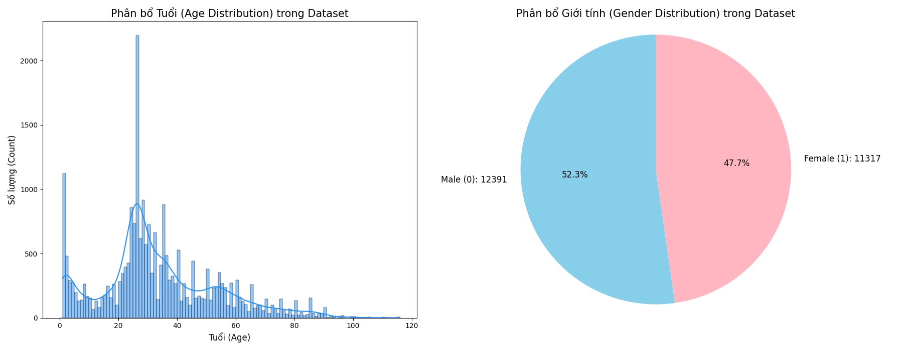
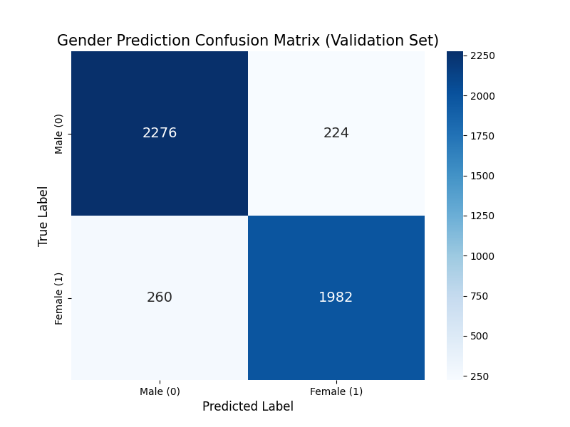
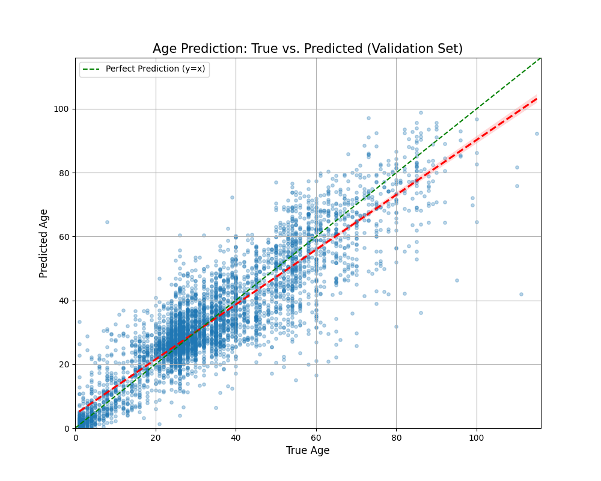
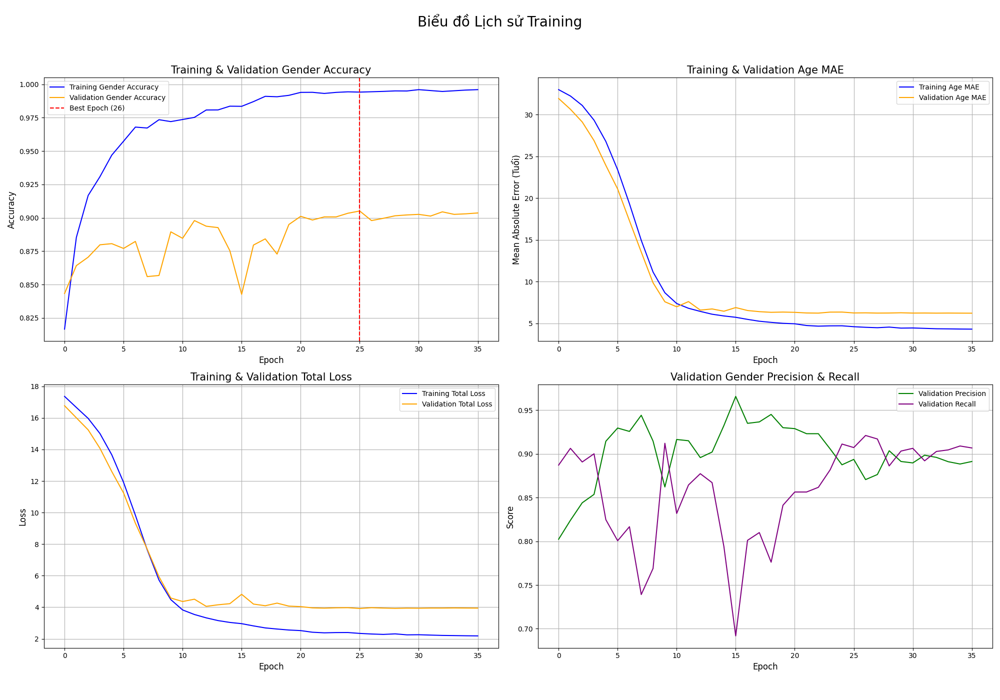
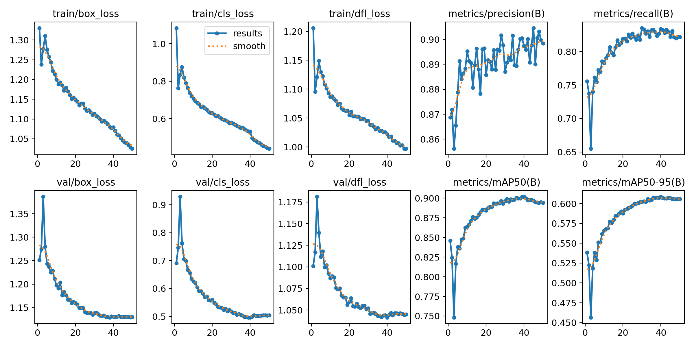

-----

# Đồ án: Nhận diện Tuổi và Giới tính thời gian thực (YOLO + MobileNetV2)

Đây là source code cho đồ án phát hiện khuôn mặt và dự đoán tuổi, giới tính. Hệ thống sử dụng kết hợp 2 mô hình: **YOLO** để phát hiện khuôn mặt và **MobileNetV2** để trích xuất đặc trưng và dự đoán.

## 🌟 Tính năng chính

  * **Phát hiện khuôn mặt:** Sử dụng mô hình YOLO đã được huấn luyện để xác định vị trí khuôn mặt trong ảnh hoặc video stream.
  * **Dự đoán Tuổi & Giới tính:** Sử dụng mô hình MobileNetV2 đã được tinh chỉnh (fine-tuned) trên bộ dữ liệu UTKFace để dự đoán tuổi (dạng hồi quy) và giới tính (dạng phân loại nhị phân).
  * **Pipeline:** Kết hợp cả hai mô hình trong một script duy nhất (`yolo+mobinew.py`) để chạy pipeline hoàn chỉnh: Phát hiện -\> Cắt mặt -\> Dự đoán.

## 🚀 Công nghệ sử dụng

  * Python 3
  * TensorFlow / Keras (Cho mô hình MobileNetV2)
  * PyTorch (Cho mô hình YOLO)
  * OpenCV (Để xử lý ảnh và video)
  * Pandas & Scikit-learn (Để xử lý dữ liệu)

## 📁 Cấu trúc thư mục (Tóm tắt)

```
source/
│
├── Face_Yolo_50ep.pt           # Model YOLO phát hiện khuôn mặt
├── mobilenet50ep_ver2.h5       # Model MobileNetV2 dự đoán Tuổi/Giới tính
│
├── yolo+mobinew.py             # Script chính để chạy pipeline
├── requirements.txt            # Các thư viện cần thiết
│
├── dataset_distribution_plots.png  # Biểu đồ phân bổ dữ liệu
├── gender_confusion_matrix.png     # Ma trận nhầm lẫn (Giới tính)
├── age_prediction_scatter.png      # Biểu đồ phân tán (Tuổi)
│
└── ... (các file khác)
```

## 🚀 Demo
pass

## 📊 Kết quả Huấn luyện

Dưới đây là một số kết quả trực quan hóa từ quá trình huấn luyện và đánh giá mô hình MobileNetV2 trên bộ dữ liệu UTKFace.

### 1\. Phân bổ Dữ liệu (Dataset Distribution)

Biểu đồ cho thấy sự phân bổ của tuổi và giới tính trong bộ dữ liệu UTKFace được sử dụng.

### 2\. Đánh giá mô hình Giới tính (Gender Prediction)

Ma trận nhầm lẫn (Confusion Matrix) cho thấy hiệu suất của mô hình khi dự đoán giới tính (0: Male, 1: Female) trên tập validation.

### 3\. Đánh giá mô hình Tuổi (Age Prediction)
Biểu đồ phân tán (Scatter Plot) so sánh giữa tuổi thật (True Age) và tuổi dự đoán (Predicted Age). Đường màu xanh lá cây thể hiện dự đoán hoàn hảo (y=x).


### 4. Đánh giá kết quả huấn luyện

Biểu đồ này trực quan hóa quá trình học của mô hình. Nó so sánh các chỉ số (Accuracy, MAE, Loss) giữa tập huấn luyện (train) và tập kiểm thử (validation) để đánh giá hiệu suất tổng quát.



### 5. Kết quả training YOLOv11


## 🔧 Cách chạy

1.  **Clone repository:**

    ```bash
    git clone https://github.com/sweetvn04/source_da4
    cd source_da4/source
    ```

2.  **Cài đặt các thư viện cần thiết:**
    (Nên tạo một môi trường ảo `venv` hoặc `conda` trước)

    ```bash
    pip install -r requirements.txt
    ```

3.  **Chạy script chính:**
    Script `yolo+mobinew.py` sẽ tải các mô hình (`.pt` và `.h5`) và chạy pipeline. Bạn có thể cần điều chỉnh nguồn đầu vào (webcam, file video, hoặc ảnh) trong script.

    ```bash
    python yolo+mobinew.py
    ```

-----